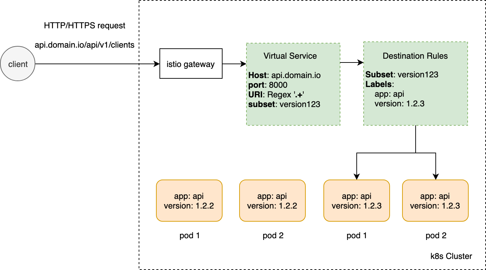
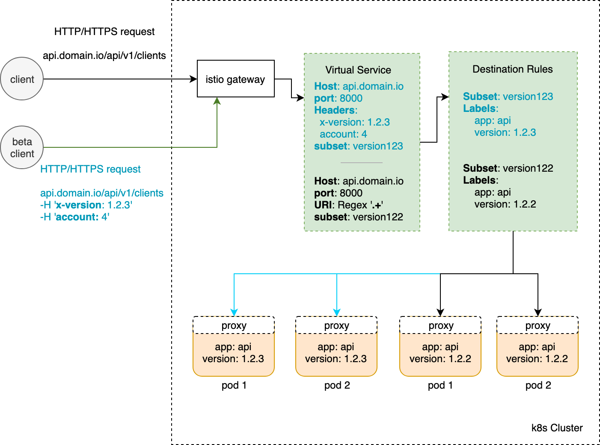
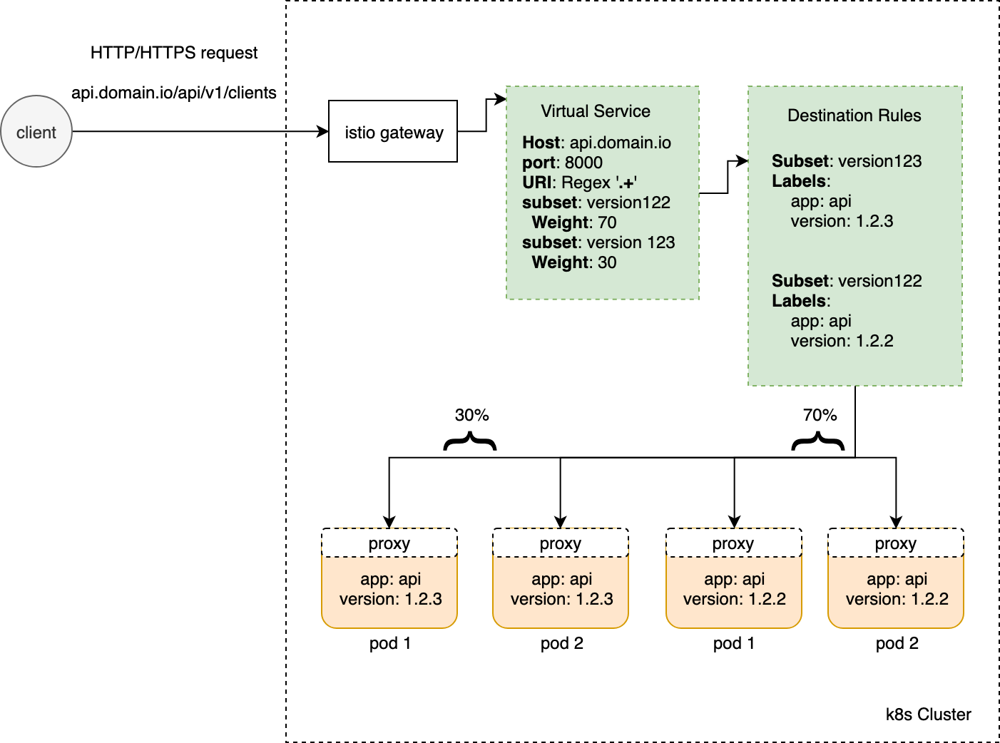

[](https://gitlab.com/pismo-pub/istiops/commits/master)

# Istio Ops: Traffic Shifter

Istio Traffic Shifter (a.k.a `istiops`) is a tool to manage traffic for microservices deployed via [Istio](https://istio.io/). It simplifies deployment strategies such as bluegreen or canary releases with no need of messing around with tons of `yamls` from kubernetes' resources.


## Documentation

* [Architecture](#architecure)
* [Running tests](#running-tests)
* [Building the CLI](#building-the-cli)
* [Prerequisites](#prerequisites)
* [How it works ?](#how-it-works-)
    - [Traffic Shifting](#traffic-shifting)
* [Using CLI](#using-cli)
    - [Get current routes](#get-current-routes)
    - [Clear all routes](#clear-all-routes)
    - [Headers routing](#shift-to-request-headers-routing)
    - [Weight Routing](#shift-to-weight-routing)
* [Importing as a package](#importing-as-a-package)
* [Contributing](#contributing)

## Architecture


## Running tests

`go test ./... -v`

Or you can use Docker as well in order to not mess with your system

```shell script
docker build . -f Dockerfile.test -t istiops-tests
docker run -t istiops-tests
```

## Building the CLI

To use istiops binary you can just `go build` it. It will generate a command line interface tool to work with.

`./run` or `go get && build -o build/istiops main.go`

You can then run it as: `./build/istiops version`

## Prerequisites

- `go` version `1.12`+ (due to [go modules](https://github.com/golang/go/wiki/Modules#quick-start) usage)
- A kubernetes config at `~/.kube/config` which allows the binary to `GET`, `PATCH`, `UPDATE` and `LIST` resources: `virtualservices` & `destinationrules`.
 If you are running the binary with a custom kubernetes' service account you can use this RBAC template to append to your roles:

```sh
- apiGroups: ["networking.istio.io"]
  resources: ["virtualservices", "destinationrules"]
  verbs: ["get", "list", "patch","update"]
  ````

## How it works ?

Istiops creates routing rules into virtualservices & destination rules in order to manage traffic correctly. This is an example of a routing being managed by Istio, using as default routing rule any HTTP request which matches as URI the regular expression: `'.+'`:



We call this `'.+'` rule as **master-route**, which it will be served as the default routing rule.

### Traffic Shifting

A deeper in the details

1. Find the needed kubernetes' resources based on given `labels-selector`

2. Create associate route rules based on `pod-selector` (to match which pods the routing will be served) & destination information (such as `hostname` and `port`)

3. Attach to an existent route rule a `request-headers` match if given



4. Attach to an existent route rule a `weight` if given. In case of a `weight: 100` the balance-routing will be skipped.



## Using CLI


### Each operation list, creates or removes items from both the VirtualService and DestinationRule

### Get current routes

Get all current traffic rules (respecting routes order) for resources which matches `label-selector`

```shell script
istiops traffic show \
    --label-selector environment=pipeline-go \
    --namespace default
```

Ex.

```
Resource:  api-domain-virtualservice

client -> request to ->  [api.domain.io]
  \_ Headers
      |- x-account-id: 3
      |- x-cid: seu_madruga
       \_ Destination [k8s service]
         - api-domain:5000
            \_ 100 % of requests for pods with labels
               |- app: api-domain
               |- build: PR-10


  \_ regex:".+"
       \_ Destination [k8s service]
         - api-domain:5000
            \_ 90 % of requests for pods with labels
               |- build: PR-10
               |- app: api-domain

         - api-domain:5000
            \_ 10 % of requests for pods with labels
               |- app: api-domain
               |- build: PR-10
```

The output can be configured as `-o json`/`-o yaml` int order to get an object to extract structured data.

### Clear all routes

2. Clear traffic rules based on input modes

There are two modes (or "clear ways") for `clear` command:
* `soft` (default)  
    It will remove every routing rule with no pods (from subset's deployment based on labels) to route for
* `hard`  
    It will remove **every** rule except the master-route one and routes with prefix rules

Example:  
`istiops traffic clear -l app=api-domain -n namespace`  
`istiops traffic clear -l app=api-domain -n namespace -m hard`  

### Shift to request-headers routing

3. Send requests with HTTP header `"x-cid: seu_madruga"` to pods with labels `app=api-domain,build=PR-10`

```shell script
istiops traffic shift \
    --namespace "default" \
    --destination "api-domain:5000" \
    --build 3 \
    --label-selector "app=api-domain" \
    --pod-selector "app=api-domain,build=PR-10" \
    --headers "x-cid=seu_madruga"
```

By default header's value is an exact match, you can configure to it's value matches a regular expression passing the flag `-r` or `--regexp`.

Example for a rule which header `x-id` can be match by either `1`, `2`, `3` or `4`.

`istiops ... -r -H 'x-id=1|2|3|4'`

### Shift to weight routing
4. Send 20% of traffic to pods with labels `app=api-domain,build=PR-10`

```shell script
istiops traffic shift \
    --namespace "default" \
    --destination "api-domain:5000" \
    --build 3 \
    --label-selector "app=api-domain" \
    --pod-selector "app=api-domain,build=PR-10" \
    --weight 20
```

## Importing as a package

You can assemble `istiops` as an interface for your own Golang code, to do it you just have to initialize the needed struct-dependencies and call the interface directly. You can see proper examples at `./examples`

## Contributing

If you want to contribute to a project and make it better, your help is very welcome.

### How to make a clean pull request

- Create a personal fork of the project on Github.
- Clone the fork on your local machine. Your remote repo on Github is called `origin`.
- Add the original repository as a remote called `upstream`.
- If you created your fork a while ago be sure to pull upstream changes into your local repository.
- Create a new branch to work on! Branch from `develop` if it exists, else from `master`.
- Implement/fix your feature, comment your code.
- Follow the code style of the project, including indentation.
- If the project has tests run them!
- Write or adapt tests as needed.
- Add or change the documentation as needed.
- Squash your commits into a single commit with git's [interactive rebase](https://help.github.com/articles/interactive-rebase). Create a new branch if necessary.
- Push your branch to your fork on Github, the remote `origin`.
- From your fork open a pull request in the correct branch. Target the project's `develop` branch if there is one, else go for `master`!
- …
- If the maintainer requests further changes just push them to your branch. The PR will be updated automatically.
- Once the pull request is approved and merged you can pull the changes from `upstream` to your local repo and delete
your extra branch(es).

And last but not least: Always write your commit messages in the present tense. Your commit message should describe what the commit, when applied, does to the code – not what you did to the code.
